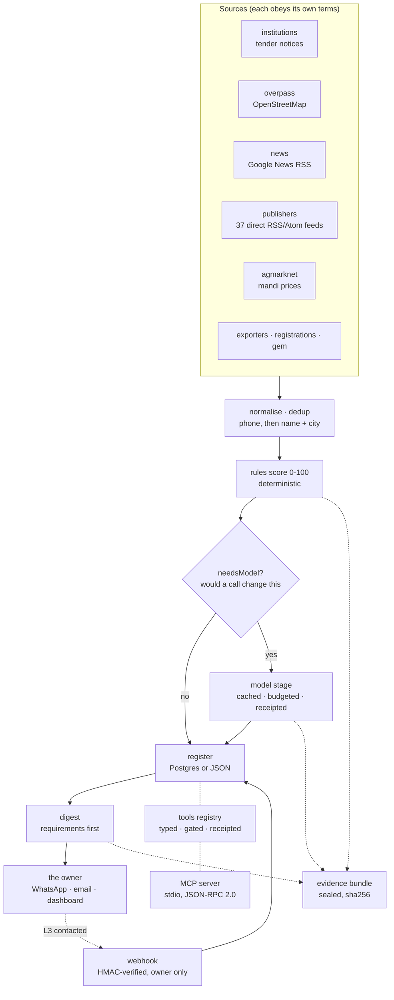
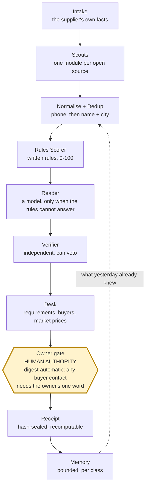
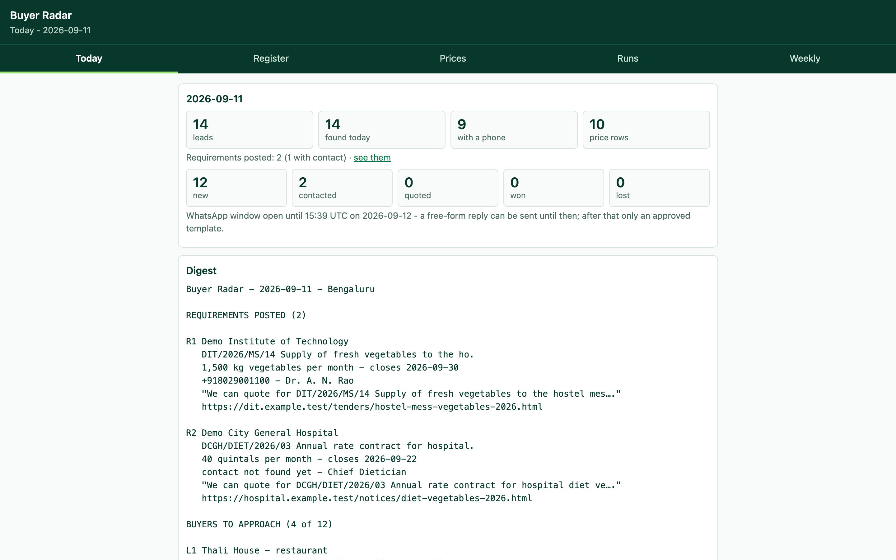
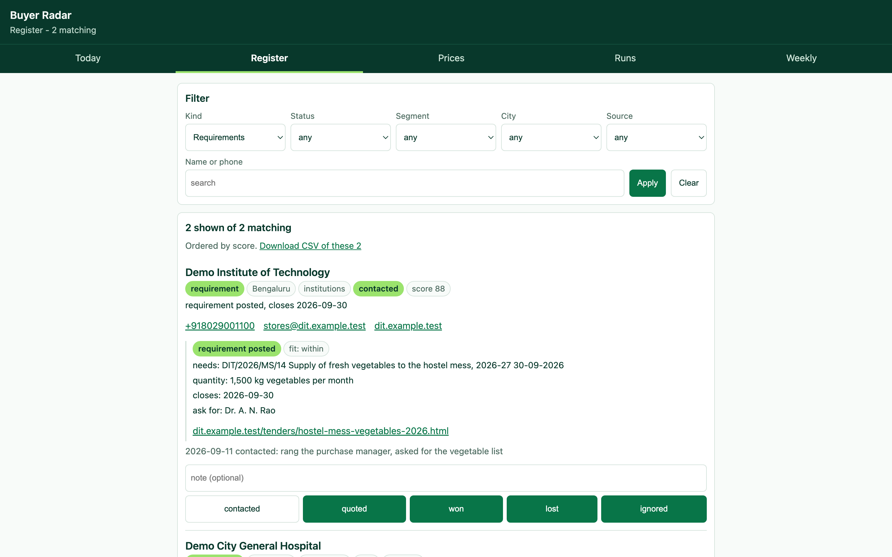
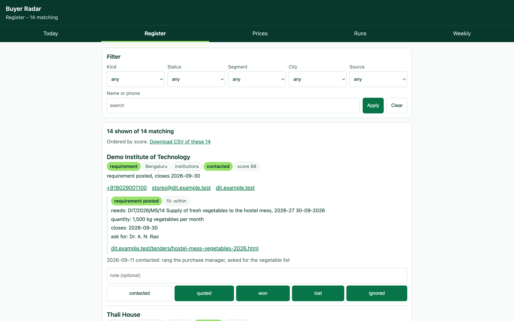
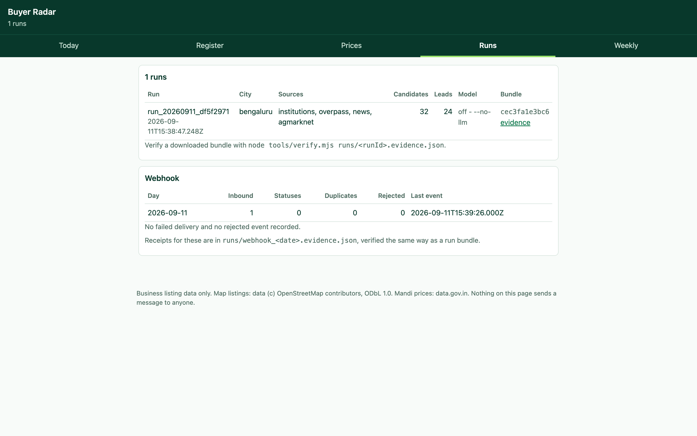
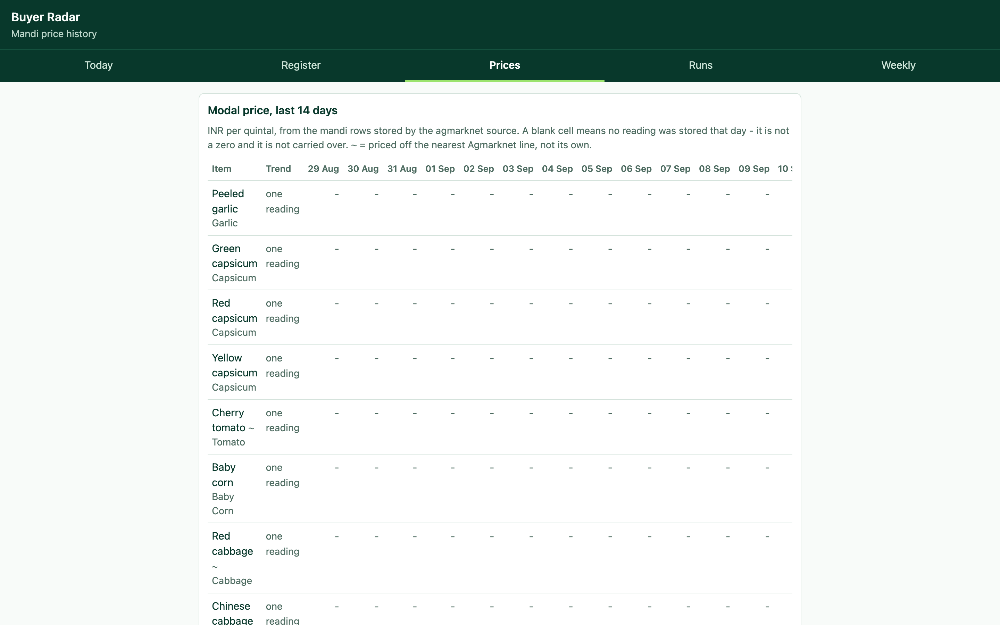
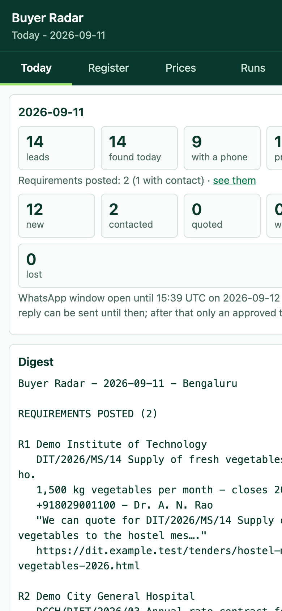

# Buyer Radar

A daily lead-finding agent service for produce suppliers: finds buyers and posted
requirements from sources that permit it, scores them by rules, reads the hard
cases with a model only when needed, and hands the owner a digest with receipts
you can hash yourself.

[](https://github.com/vamsi-venkatesh/buyer-radar/actions/workflows/ci.yml)

```bash
git clone https://github.com/vamsi-venkatesh/buyer-radar.git
cd buyer-radar && npm run demo
```

No install, no keys, no database, no network. Node 20 or newer is the only
requirement.

---

## What it does

- **Finds buyers who have posted a requirement.** An institution that has put out
  a notice for vegetable supply, with a quantity, a closing date and - where the
  notice names one - an officer to ring. A directory tells the owner that a
  hospital exists; this tells him the hospital needs 1,500 kg of vegetables a
  month, by the 30th, and who to ask for.
- **Finds buyers who probably buy**, from map listings, news signals and
  government registries, and de-duplicates them against everything seen before.
- **Scores every lead by written rules**, not by a model. The bands, the points
  and the worked examples are in [docs/scoring.md](docs/scoring.md).
- **Asks a model only when the answer could change the outcome**, under a daily
  rupee cap, through a cache, with every call and every skip receipted.
- **Hands the owner one morning digest** - WhatsApp-shaped, capped at 1,500
  characters - and a dashboard he reads on his phone. It never messages a buyer.

## Architecture



Every arrow into the register is a write that leaves a receipt. Nothing in the
diagram has an arrow pointing at a buyer, and that is deliberate - see
[ADR 3](docs/adr/0003-the-human-gate.md).

## Governance

The same workflow, read as the thing it is governed as: ten nodes, six roles,
and one human gate. [docs/governance.md](docs/governance.md) maps every node to
the modules that implement it, the receipt types it emits and the tests that
hold it in place; it also sets out what each role may call, the hash recipe an
auditor recomputes, what is remembered and what is deliberately not, and how to
run the evaluation.



The owner contacts buyers. The service never does.

## The four instruments

This is a small product built to demonstrate four things that are hard to fake.

### 1. A graph of stages, not a script

Each source is a module exporting one `fetch(ctx)`; each stage is a pure function
over the previous stage's output. `src/sources/all.mjs` is the single source
table, so the pipeline, the CLI and the tool layer cannot drift about what a
source is. A source that fails returns `blocked` with a reason and the run
continues; it never returns a fabricated row to keep a count up.

### 2. An evaluation harness with numbers attached

`eval/llm/` scores the enrichment prompt against 30 labelled synthetic pages -
wholesalers, hotels, tender notices, news items, and pages that are not
businesses at all. `eval/lib/score.mjs` knows nothing about segments; it takes
labelled cases and counts, so the next evaluation can reuse it.

Run against DeepSeek on **2026-09-11**, prompt `enrich/2026-09-11a`:

| Measure | Result |
| --- | --- |
| JSON validity | 100% (30/30) |
| segment accuracy | 100% (30/30) |
| deadline accuracy | 100% (30/30) |
| size accuracy | 93.3% (28/30) |
| every field correct | 28/30 |
| mean tokens | 979 in, 90 out |
| total cost | Rs 3.30 |

**Read that with its caveat.** Thirty cases is a smoke test, not a benchmark:
the confidence interval on 30 trials is wide, the cases were written by the same
person who wrote the prompt, and none of them is a real page. It is enough to
catch a prompt that has stopped returning JSON or has started guessing deadlines.
It is not enough to claim the model is right about real businesses.

Those numbers are not quoted from anywhere: the run that produced them is
committed as [`eval/llm/results/2026-09-11.real.md`](eval/llm/results/2026-09-11.real.md),
with the per-case answers, tokens and timings in the `.json` beside it. Both
cases the model got wrong are named in it - `fx24` and `fx25`, each a school
tender labelled `medium` and answered `large`.

With no API key the harness runs a keyword reader in place of the model and says
so in the first line of every summary. **A stub result measures the harness and
sets a floor; it is never a measurement of the model.** `eval/llm/results/` holds
both: the real run above, and `2026-09-11.stub.md`, labelled as the stub it is.
The stub scores 70% on size where the model scores 93.3%, which is the gap the
model is being paid for.

### 3. Sealed receipts, and the recipe to check them

Every run writes `runs/<runId>.evidence.json`: an ordered chain of receipts -
`run.created`, one `source.fetched` per source, `source.blocked` for anything
that did not work, `leads.upserted`, the model stage's receipts, `digest.rendered`,
`digest.delivered` or `digest.not_sent` - ending in `evidence.sealed` with a hash.

The hash is `sha256` over, exactly:

```
schema + "\n" + receipts.length + "\n"
then, for each receipt in order: JSON.stringify(receipt) + "\n"
```

with `schema = "vvdex.evidence-bundle/v1"`. Recompute it yourself:

```bash
node tools/verify.mjs runs/<runId>.evidence.json

# or, without this project at all:
node -e '
const b = require("./runs/<runId>.evidence.json");
const body = b.schema + "\n" + b.receipts.length + "\n" +
             b.receipts.map((r) => JSON.stringify(r) + "\n").join("");
console.log(require("crypto").createHash("sha256").update(body).digest("hex"));
console.log(b.hash);'
```

This is tamper-**evidence**, not tamper-proofing: anybody who can write the file
can reseal it. Defending against that needs an external anchor and is out of
scope, which is said here rather than implied away.
See [ADR 2](docs/adr/0002-receipts-and-the-hash-recipe.md).

### 4. Governed memory, and a human gate on every write

The register is memory with rules. A merge never overwrites `status` or `notes` -
those belong to the register, never to a fetch. `segment_source` and
`segment_model` are both kept and a disagreement stays visible. A status change
appends a dated note and writes its own verifiable receipt, whether it came from
the CLI, the dashboard or a WhatsApp reply, because all three go through one
`setLeadStatus()`.

The gate is the owner. The two tools that change anything refuse a caller who is
not the owner or the pipeline, and a refusal writes `tool.refused` naming the
tool, the actor and the reason - so a register that did not move can be *shown*
not to have moved. See [ADR 6](docs/adr/0006-tools-and-mcp.md).

## The demo, in one command

```bash
npm run demo
```

It replaces the network - and nothing else. The same source modules, the same
normalisation, the same dedup, the same rules, the same digest renderer, the same
receipt chain, the same webhook handler and the same dashboard all run for real,
over synthetic responses in `demo/fixtures.mjs`. A request the demo did not
anticipate throws rather than reaching a real service.

It seeds a JSON store, runs the pipeline across the demand and directory lanes,
changes one lead's status, pushes one HMAC-signed WhatsApp message through the
real webhook handler, then serves the dashboard on `http://127.0.0.1:4710` behind
a one-time token it prints. Takes about forty seconds, because the polite
per-source pauses are real too.

```
  run       run_20260911_1391364a
  leads     24 in the register, 9 with a phone
  demand    2 posted requirements, 1 with a contact
  digest    1396 characters
  receipts  9 in runs/run_20260911_1391364a.evidence.json
  hash      7750481d8624b81dccf09e93459e6a4f1a3684eb12ee178ea40532a84db9f789
  status    Demo Institute of Technology: new -> contacted, receipt 611fa1d46115
  webhook   1 inbound, 1 reply composed, signature accepted, a tampered body rejected
  network   36 requests, all answered from demo/fixtures.mjs

  Dashboard: http://127.0.0.1:4710/login?t=<one-time token>
```

`npm run demo -- --seed` does everything except serve.

**Nothing in the demo is real.** Every business, phone number, price, tender and
article is invented; every host is under `example.test`, a reserved TLD that
resolves nowhere.

## Configure it for your own business

The engine holds no business facts. They all live in one file:

```bash
cp config/client.example.json config/client.json   # git-ignored
```

| Key | What it sets |
| --- | --- |
| `business` | Name, owner, home city, the one-line description of what you supply, the contact address in the outbound User-Agent |
| `capacity` | What you can actually fill: the headline commodity and its daily ceiling, and the daily range for everything else. The quantity score reads these |
| `cities` | Each city's display name, state, bounding box and the state name data.gov.in uses |
| `catalogue` | Every item you sell and the Agmarknet commodity it is priced from. `null` means no mandi line exists and the price sheet says so rather than guessing |
| `keywords` | What makes a notice, a tender row or a bid worth opening |
| `newsQueries` | The news searches, with `{city}` substituted |
| `openers` | The line the owner reads out, per segment. His words, not the engine's |
| `excludeSegments` | Listings you do not want, dropped during normalisation |

With no `config/client.json` the example is used, so a fresh clone runs. Run
`npm run validate` after editing: it checks the profile, the registries and the
prompt versions, and refuses a committed key or token.

FarmQuick, a Bengaluru fresh-produce supplier, is the reference deployment and
the worked example throughout the docs -
[docs/case-study-farmquick.md](docs/case-study-farmquick.md).

## Deploy

```bash
cp .env.example .env               # names and comments only; fill it in
docker compose -f docker-compose.radar.yml up -d --build
```

One `node:20-alpine` image runs as the non-root `node` user and is started twice:
`radar-dashboard` on `127.0.0.1:4710` - put a TLS reverse proxy in front, the
token is a bearer credential - and `radar-cron`, a scheduler with no system cron
in it, which wakes at wall-clock time in a named zone and so follows a DST change
instead of drifting.

| Variable | Default | Meaning |
| --- | --- | --- |
| `RADAR_OWNER_TOKEN` | - | **Required.** The dashboard refuses to start without it; there is no open mode |
| `RADAR_PORT` | `4710` | Dashboard port |
| `DATABASE_URL` | - | Postgres. Unset uses the JSON store under `data/`, with no install at all |
| `RADAR_RUN_AT` / `RADAR_TZ` | `07:00` / `Asia/Kolkata` | When the daily pass runs |
| `RADAR_CITIES` / `RADAR_SOURCES` / `RADAR_LIMIT` | `bengaluru` / `overpass,news,agmarknet` / `200` | What it runs |
| `RADAR_DELIVER` | - | `email`, `whatsapp`, or both. Empty writes the digest to a file |
| `RADAR_TO` / `RADAR_SMTP_URL` / `RADAR_FROM` | - | The owner's own address and SMTP submission over implicit TLS |
| `WA_PHONE_NUMBER_ID` / `WA_TOKEN` / `RADAR_TO_WA` | - | WhatsApp Cloud API and the owner's own number |
| `WA_VERIFY_TOKEN` / `WA_APP_SECRET` | - | The webhook. Without the secret it answers `503` and accepts nothing |
| `DATA_GOV_IN_KEY` | - | Free key for mandi prices. Without it the source is skipped with a recorded reason and no price is invented |
| `DEEPSEEK_API_KEY` / `LLM_*` | - | The model stage. No key, no stage, and every score is what the rules alone produce |
| `GEM_ENABLED` | off | The GeM lane, off because its response shape has never been observed |
| `OPENINGS_MAX_READS` | `6` | Articles the openings lane reads in one run, and therefore requirement calls it can make. `0` stops it reading any |
| `RADAR_MCP_ACTOR` | `agent` | `owner` to let an MCP client write |

Turn delivery on last, after reading a few days of `outbox/` files. Full
first-run checklist: [docs/deploy.md](docs/deploy.md).

## Sources and their terms

| Source | What it gives | Terms, and how they are kept |
| --- | --- | --- |
| `overpass` | OpenStreetMap business listings via the Overpass API | **ODbL.** Every row carries `licence: "ODbL"`, its openstreetmap.org URL and the attribution *Data (c) OpenStreetMap contributors, ODbL 1.0*. Anything published from it must carry that too. One request per city per category group, 2 s apart, and a 20 s wait when Overpass reports no free slot |
| `institutions` | Tender and notice pages on 59 institutional buyers' own sites | Each page is published by the body itself. **robots.txt is read before the first page of every host and obeyed.** One request per 3 s per host, documents capped at 2 MB. The digest carries the title, the stated requirement and a link back - the document is never republished |
| `news` | Google News RSS search, India edition | Headline, link and date only. The feed is fetched, because a feed is published to be read - but its links into `news.google.com/rss/articles/` are **never followed there**: that path is `Disallow`ed, so each item is resolved to the publisher's own URL and read under the publisher's robots.txt instead |
| `publishers` | 37 direct RSS/Atom feeds published by Indian newspapers, trade titles and institutions, listed in `config/publisher-feeds.json` | Each feed is published by that masthead for readers, and is fetched **directly** at one request per 3 s per host under this project's own User-Agent. The item's link already **is** the publisher's article page, so no aggregator redirect is followed and none is ever stored. Every kept item is **tiered** - `requirement_candidate` or `awareness`, see [two tiers](#two-tiers-and-only-one-of-them-costs-money) - and only a requirement candidate's article is read by the openings lane, under **that publisher's** robots.txt. All 67 candidates were probed once for real; `config/publisher-feeds.probe.json` records what each answered and why 30 were dropped |
| `agmarknet` | Daily mandi prices, data.gov.in | Government Open Data Licence - India. Needs a free key. Without it the source is **skipped with a recorded reason**; prices are never invented. The key is redacted out of every recorded URL |
| `exporters` | The APEDA registered exporter directory | Public government registry, no login and no captcha on the directory. It publishes **no contact**, so this lane produces buyers with an address and no phone, and the row says so rather than leaving the field to look unread |
| `registrations` | 22 buyers' public supplier-onboarding pages | Fetched **once a week, on Mondays** - an onboarding page does not change daily, and a section the owner can never act on differently is one he learns to skip |
| `cppp` | Central Public Procurement Portal | Every listing surface was **captcha-gated** when checked on 2026-09-11. The source detects it, records `source.blocked` with the exact reason, and stops. **It does not read, solve or bypass a captcha**, and it never fabricates a tender to fill the gap |
| `gem` | Government e Marketplace public bids | **Off unless `GEM_ENABLED=true`.** Every request to the GeM estate timed out at the TCP connect stage when checked, so its parser is written against a response shape this project **documents as assumed and has never observed**. A body that does not match produces nothing at all and a `source.blocked` of kind `unrecognised-shape` |

**Deliberately not implemented:** IndiaMART, JustDial, LinkedIn, Facebook, Zomato
and Swiggy. Their terms forbid this kind of collection - IndiaMART also answered
403 when checked. Do not add them. See
[ADR 4](docs/adr/0004-robots-and-terms.md).

### Two tiers, and only one of them costs money

The first real run of the openings lane on the reference deployment read **12
publisher articles and made 34 model calls**. It found **0 articles stating a
requirement** and produced **0 contacts**. Every one of the 12 was an opening or
an expansion story: a hotel chain's key count for 2030, a restaurant's new
outlet, a campus inauguration. An opening is awareness. It is not procurement,
and no amount of model reading turns it into procurement.

So the lane splits its signals in two before it spends anything:

| Tier | What it is | What the lane does |
| --- | --- | --- |
| `requirement_candidate` | The title or the summary uses procurement wording within **140 characters** of a produce or food-service word | The article is fetched and the model is asked |
| `awareness` | An opening or expansion word within **90 characters** of a place that will need vegetables | Kept as a `signal` with its `why_now`. **No article fetch. No model call.** Receipt `openings.awareness_only` |

An awareness signal is not thrown away - a hotel that opens in October is a buyer
in November - it is simply never paid for. The publisher-feed lane tiers its own
items, because it matched the title **and** the summary, and writes the answer to
`extra.matchTier`; anything else, a Google News headline included, is tiered in
the openings lane from the words it carries. A signal that matches neither rule
is awareness: whatever made it eligible, nothing in it says a requirement has
been posted.

Three guards, in this order, and each one is receipted:

1. **the tier** - `openings.awareness_only`, and nothing is fetched;
2. **the pre-check in `needsModel('requirement', ...)`** - the article was
   fetched and uses no procurement wording anywhere in its text, so no model is
   called: `llm.not_needed { reason: 'no procurement wording' }`. Both real
   article fixtures in the test suite - a hotel expansion and a college
   inauguration - fail this check, which is what those 34 calls bought;
3. **the per-run cap** - `OPENINGS_MAX_READS`, **default 6** article reads and
   therefore at most 6 requirement extractions in a run. When it is reached the
   remaining candidates are left unread with the reason on their own record, and
   `openings.cap_reached { cap, articlesRead }` is written once.

The run summary and the dashboard's **Openings** column both print what happened:

```
openings     13 signals (2 requirement candidates, 11 awareness-only - no fetch, no model), 0 articles read of a cap of 6, ...
```

The word lists behind the two rules live in `src/lib/profile.mjs`. The trade's
half is the engine's - a canteen is a canteen whoever fills it, and a tender is a
tender whoever is bidding - and the supplier's half is read from the client
profile, so a deployment that sells something else replaces `signals` in
`config/client.json` and touches no source.

## Model policy

*Model only when needed.* The rules are one pure function,
`needsModel(purpose, lead, ctx)` in `src/llm/needs.mjs`, asked before every call
and answered with a reason either way.

**enrich** - needed only if the source gave no segment beyond `other`, **or** the
size is unknown and the lead's score is within **10 points** of the digest
cut-off for its section, **or** the lead is a requirement carrying no closing
date - **and** there is text to read, **and** the cache does not already hold the
answer. The cut-off is computed from the leads the run actually holds, so it is
the real boundary and not a guess.

**opener** - needed only for a lead the digest will actually show **and** that
carries at least one concrete fact: an evidence quote, the `<title>` of their
website, the requirement text, or a stated quantity or deadline. Without one the
model would be paraphrasing the trading name, which the rule-based line already
does for nothing.

**requirement** - first a hard pre-check that sits above every other rule here,
the article rule included: the text has to use **procurement wording at all** -
one word from the configured requirement list (`tender`, `e-tender`, `RFQ`,
`EOI`, `expression of interest`, `supply of`, `empanelment`, `rate contract`,
`annual supply`, `vendor registration`, ...) in `src/lib/profile.mjs`. A text
that never says any of them does not contain a posted requirement and no model
will find one in it, so the call is refused with
`llm.not_needed { reason: 'no procurement wording' }`.

Past that, it is needed only when the deterministic readers found **no**
quantity, **no** closing date and **no** contact. When they found any of the
three, the lane builds the requirement from what they read and makes no call.

That rule holds for a **notice**, because the body that wants the vegetables
published it: the quantity on it is that body's quantity and the number on it is
that body's number. It does not hold for a **newspaper article**, which one
organisation published about another. So a page the openings lane fetched from a
publisher sets `needsOrganisation`, and the model is then needed **whatever** the
regexes read off it - because the one thing that page will never tell a regex is
which organisation has the requirement and where its own website is. The contact
is read off **that** organisation's site or not at all: a phone number printed on
a newspaper's page is the newspaper's.

A cached answer is free, so the cache is checked first and only a call that would
cost money is put to the rules.

**The cap.** Spend is capped per day in rupees by `LLM_DAILY_BUDGET_INR`
(default 200), computed from the tokens the provider reported and the price table
in `config/llm-prices.json`. That table **states its source and its date, and was
written from prior knowledge rather than fetched from a pricing page** - check it
before treating any cost figure as exact. The day's total lives in the store, so
restarting does not hand the cap back.

**The receipts.** Every call and every refusal:

```
llm.call             { purpose, provider, model, promptVersion, inputHash,
                       inputTokens, outputTokens, costInr, ms, cacheHit: false }
llm.cache_hit        { ..., costInr: 0, cacheHit: true }
llm.not_needed       { purpose, leadId, reason }
llm.budget_exhausted { purpose, day, spentInr, capInr, estimateInr }
llm.invalid_output   { ..., reason, repairAttempted: true }
llm.disabled         { reason }
```

The run summary and the dashboard's Model column print the four numbers together:

```
llm  deepseek/deepseek-chat: 4 calls, 5 not needed, 0 cache hits, Rs 0.5072 spent, 0 skipped by budget
```

A prompt's `version:` is part of the cache key, and the loader **refuses a prompt
with no version** - editing the wording without bumping it would silently serve
answers written by the old one. See
[ADR 1](docs/adr/0001-rules-first-model-gated.md).

## Tools and MCP

Everything an agent may do is one of these, and every one leaves a receipt.

| Tool | Kind | Cost | What it does |
| --- | --- | --- | --- |
| `leads.search` | read | free | Search the register by status, segment, city, kind or free text. Best score first |
| `leads.get` | read | free | One lead by id. `found: false` rather than an error when there is none |
| `leads.set_status` | write | free | **Owner only.** Move a status and append a dated note, through the same `setLeadStatus()` the CLI uses |
| `prices.get` | read | free | Mandi readings already in the store. Fetches nothing; an item with no reading is **named as having none**, never zeroed |
| `web.fetch` | network | free | One page as text, under that host's robots.txt, 2 s per host, 300 KB cap. A disallowed page is `ok: false` with the rule as the reason and **is never requested** |
| `contacts.extract` | read | free | Indian phones, emails and the person a "Contact Person:" block names. No network, no model |
| `pdf.text` | network | free | Text out of a PDF. A scan is `ok: false, reason: unreadable`, never an empty string |
| `source.run` | network | free | Run one source and report what it returned. **Writes nothing to the register** |
| `digest.render` | read | free | Render the digest from the store. Writes nothing, sends nothing, calls no model |
| `owner.message` | write | free | **Owner only.** One WhatsApp text to the owner's own number. **There is no recipient field** |
| `model.read` | model | **metered** | Ask the model to read text, through the same cache, cap and receipts the pipeline uses |

```bash
npm run mcp                                            # MCP over stdio
node src/tools/cli.mjs list                            # every tool, kind and cost
node src/tools/cli.mjs call leads.search '{"limit":5}'
node tools/verify.mjs runs/tools_$(date +%F).evidence.json
```

The MCP server is plain Node with no dependencies, JSON-RPC 2.0, protocol
`2024-11-05`. `RADAR_MCP_ACTOR` **defaults to `agent`**: a model can read
everything and change nothing until the owner says otherwise in his own
environment. A refused tool comes back as a result with `isError: true`, not a
protocol error - the model asked a legitimate question and is owed "no, and here
is why" in a form it can read. Client configuration and a full round trip:
[docs/mcp.md](docs/mcp.md).

## Security and privacy

- **Owner token.** One bearer credential, compared constant-time, held in an
  `HttpOnly; SameSite=Strict` cookie. **The dashboard refuses to start without
  it** - there is no unauthenticated mode to fall back to. Put TLS in front.
- **HMAC webhooks.** Every inbound POST body is HMAC-SHA256'd with the Meta app
  secret and compared constant-time with `X-Hub-Signature-256`, over the exact
  bytes received. With the secret unset the route answers `503` and accepts
  nothing: an unsigned event is never trusted. Every message id is recorded once,
  so a redelivery does not move a lead twice.
- **No cold messaging.** There is no channel in this codebase that can reach a
  lead. The only outbound address is the owner's own, and `owner.message` has no
  recipient field. A message from any number other than the owner's is recorded
  and never answered - and for those the record keeps the sender, the type and
  the character count, **not the text**.
- **Business contacts, not private ones.** A trading name, a business phone, a
  business address. From the demand lane also the **officer a public procurement
  notice names as the person to approach** - that is a person named in an
  official capacity on a document their employer published for exactly this
  purpose, and a requirement without it is not something the owner can act on.
  Under India's DPDP Act that is a narrow, purpose-bound use of contact details
  the data fiduciary itself made public; nobody is profiled, enriched or tracked
  across sources, and a notice that names nobody yields no name. If an officer
  asks to be removed, delete the lead - the register is one store and one id.
- **No secret ever reaches a file.** Keys come from the environment.
  `.env.example` carries names and comments only. An API key is redacted out of
  every recorded URL before it reaches a receipt, and `npm run validate` fails on
  a committed key, token or private key.
- Report a vulnerability privately: [SECURITY.md](SECURITY.md).

## Screenshots

From a local `npm run demo` run. Every business, number and notice in them is
synthetic.

| | |
| --- | --- |
|  |  |
| **Today** - counts, the digest, requirements posted with contacts, the funnel | **Requirements** - what they need, how much, by when, who to ask for, and the notice itself |
|  |  |
| **Register** - filter by kind, status, segment, city, source; `tel:` links; status written through one function | **Runs** - every run with its sources, counts, blocked sources, bundle hash and a download link |
|  |  |
| **Prices** - 14 days of modal prices per catalogue item. A day with no reading is blank, never zero and never carried over | **Phone** - the same pages, mobile-first, because that is where the owner reads them |

## Case study

[docs/case-study-farmquick.md](docs/case-study-farmquick.md) - what the reference
deployment actually found in Bengaluru, including the days when the answer was
"very little", and the three bugs that only live data caught.

## Roadmap

1. **The openings lane has its article supply, and it produced nothing.** The
   supply is real: `config/publisher-feeds.json` holds **37 live publisher
   feeds**, every one probed once for real, and their items link straight at the
   publisher's own article page. Articles now reach the lane and are fetched from
   their publishers under **those publishers' robots.txt** - not one refusal in
   the whole probe - and the model reads the real article text.

   What came back is the honest part. In the first real run of the lane the model
   read **12 articles and produced 0 posted requirements.** Nothing broke: an
   article reporting that a hotel group is opening 200 rooms or that a chain is
   expanding into a second city is **awareness, not procurement**. It says a
   buyer will exist; it does not say a requirement has been posted, and there is
   nothing on the page for the lane to turn into one. The posted requirements
   this product finds come from the `institutions` lane, where the buyer
   published the notice himself.

   That question - whether reading opening-and-expansion news is worth its model
   calls at all - is now answered in the code: it is not, and the lane keeps
   those items as signals and spends only on the ones that name a tender. See
   [two tiers, and only one of them costs
   money](#two-tiers-and-only-one-of-them-costs-money). What the lane has
   **still** not done is read a genuine posted requirement end to end. The first
   day a tender article arrives from a publisher feed is the day the paid path
   is tested for real.
2. **Correct the institutional registry.** 44 of 59 entries did not answer and
   most of the 404s are wrong paths a human could fix in an afternoon.
3. **Read one real GeM response** and correct the parser and its documented
   assumed shape together, or delete the lane.
4. **Calibrate the score against outcomes.** Points are currently judgement.
   Once enough leads have reached `won` or `lost`, fit the bands to what actually
   converted and publish the before and after.
5. **A second vertical.** Everything client-specific is already one JSON file;
   the honest test is whether a non-produce supplier can run it without touching
   `src/`.

## Layout

```
src/client.mjs        the client profile: every business fact, loaded and validated
src/config.mjs        engine settings: endpoints, pacing, caps, licences
src/model.mjs         Candidate -> Lead, scoring, dedup, merge, openers
src/run.mjs           the pipeline and its CLI
src/sources/*.mjs     one module per source, each exporting fetch(ctx)
src/llm/              the model stage: client, cache, budget, needs, prompts
src/lib/profile.mjs   the word lists behind the two signal tiers: the trade's
                      half from the engine, the supplier's from the profile
src/tools/            the tool registry, its JSON Schema validator, its CLI
src/mcp/server.mjs    MCP over stdio, JSON-RPC 2.0, no dependencies
src/dashboard/        the owner's dashboard: server-rendered HTML, no JavaScript
src/webhook.mjs       the WhatsApp webhook: signature, idempotency, owner commands
src/digest.mjs        the morning digest; src/report.mjs the weekly one
src/deliver.mjs       delivery to the OWNER only - email and WhatsApp
src/cron.mjs          the scheduler: one daily pass, no system cron
src/lib/*.mjs         stores, receipts, crawler, PDF text, contacts, quantities
config/               the client profile, the registries and their probes, the price table
demo/                 synthetic fixtures and the one-command demo
eval/                 the labelled cases, the stub model, the scorer, the results
test/                 345 tests, node --test, saved and synthetic fixtures
tools/                verify.mjs, validate.mjs, the probes, the fixture builders
docs/adr/             six decisions, and why
```

`data/`, `runs/`, `digests/`, `exports/`, `reports/` and `outbox/` hold generated
output and are git-ignored.

## Tests

```bash
npm test        # 345 tests
npm run validate
```

**No test makes a real model call, contacts a real SMTP server or the real
WhatsApp Cloud API, or touches a live source.** The SMTP client is tested against
a fake submission server built on `node:net`; the webhook against real requests
to the real route with the signature computed over the exact bytes sent; the MCP
server by spawning it as a child process and driving it over real stdio, with the
leads file read off disk afterwards to prove a refused write wrote nothing.

Several tests exist because live data broke the code first, and each pins the
real wording: a date split across table cells that parsed as a phone number, a
page footer offered as a contact person, "mess" matching inside "message", the
e-procurement helpdesk offered as the buyer, and a request deadline that covered
the headers but not the body and so hung an entire run with no error.

## Licence

MIT. See [LICENSE](LICENSE).

Data collected through this software carries its own terms, and they are not
MIT. OpenStreetMap data is ODbL and must keep its attribution; data.gov.in data
is under the Government Open Data Licence - India. Redistributing what you
collect is your responsibility, not this licence's.
