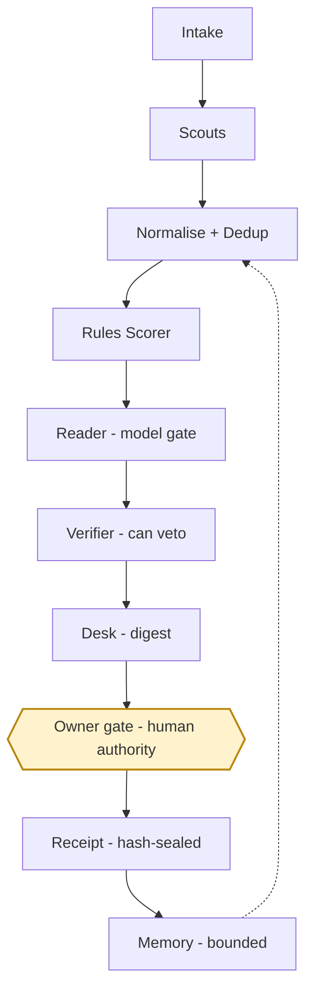

# Governance

This document maps the running code to the workflow it is governed as. Every
row below names files you can open, receipt types you can grep for in a sealed
bundle, and the tests that hold the behaviour in place. Where the code does
less than the shape suggests, the row says so.

The workflow is ten nodes. One of them is a human gate.



The digest passes the gate on its own. Nothing that touches a buyer does. The
gate is the subject of [ADR 0003](adr/0003-the-human-gate.md) and of the section
"The human gate, as implemented" below.

---

## 1. The nodes

| Node | Module(s) | Receipts emitted | Tests |
| --- | --- | --- | --- |
| **Intake** — the supplier's own facts: business, capacity, catalogue, cities, keywords, digest caps | `src/client.mjs`, `src/config.mjs`, `config/client.example.json` | `run.created` (city, sources, limit, profile in force) | `test/template-params.test.mjs`, `test/run.test.mjs` |
| **Scouts** — one module per open source, each returning candidates or a stated block | `src/sources/overpass.mjs`, `news.mjs`, `publishers.mjs`, `institutions.mjs`, `gem.mjs`, `registrations.mjs`, `exporters.mjs`, `cppp.mjs`, `agmarknet.mjs`, indexed by `src/sources/all.mjs` | `source.fetched` (source, count, ms, detail), `source.blocked` (source, reason) | `test/sources.test.mjs`, `test/publishers.test.mjs`, `test/demand.test.mjs` |
| **Normalise + Dedup** — one shape for a lead, then merge on phone digits and on name+city | `src/lib/normalise.mjs` (`normalisePhone`, `normaliseEmail`, `normaliseWebsite`, `normaliseName`, `normaliseCity`), `src/model.mjs` (`toLead`, `phoneKey`, `nameCityKey`, `mergeLeads`, `upsertLeads`) | `leads.upserted` (added, updated, total) | `test/run.test.mjs`, `test/register.test.mjs` |
| **Rules Scorer** — the written rules, 0–100, no model involved | `src/model.mjs` (`scoreLead`, `scoreRequirement`, `SEGMENT_POINTS`, `CONTACT_POINTS`, `RECENCY_POINTS`, `DEADLINE_POINTS`, `QUANTITY_FIT_POINTS`, `REQUIREMENT_CONTACT_POINTS`, `REQUIREMENT_PLACE_POINTS`) | no receipt of its own; the totals it produced are carried in `leads.upserted` and `digest.rendered` | `test/model.test.mjs` |
| **Reader** — a model, asked only when the rules cannot answer, under a daily cap with a cache | gate: `src/llm/needs.mjs` (`needsModel`); runner: `src/llm/stage.mjs`; cost: `src/llm/budget.mjs`; cache: `src/llm/cache.mjs`; prompts: `src/llm/prompts/`, `src/llm/enrich.mjs`, `src/llm/requirement.mjs`; on/off: `src/llm/settings.mjs` | `llm.not_needed` (purpose, leadId, the rule that decided), `llm.cache_hit`, `llm.call` (model, tokens, cost), `llm.budget_exhausted`, `llm.error`, `llm.disabled`, `llm.enriched`, `llm.opener`, `llm.page_skipped`, `openings.skipped`, `openings.finished` | `test/needs.test.mjs`, `test/llm.test.mjs` |
| **Verifier** — an independent check on the model's answer that can throw it away | shape check: `parseEnrich` in `src/llm/enrich.mjs`, `parseRequirement` in `src/llm/requirement.mjs`; confidence gate: `modelInputs` in `src/model.mjs` (`MODEL_MIN_CONFIDENCE = 0.7`); file-level checks: `tools/validate.mjs`; bundle check: `verifyBundle` in `src/lib/receipts.mjs` | `llm.invalid_output` (purpose, reason, the problems found) | `test/llm.test.mjs`, `test/model.test.mjs`, `test/receipts.test.mjs` |
| **Desk** — composes the morning digest: requirements, buyers, market prices, under the character cap | `src/digest.mjs` (`renderDigest`, `renderPriceSheet`, `diversifyTies`, `writeDigest`), caps from `DIGEST` / `DIGEST_SECTIONS` in `src/config.mjs` | `digest.rendered` (shown, considered, requirements shown, requirements with a contact, chars) | `test/digest.test.mjs` |
| **Owner gate** — the human authority. The digest goes out on its own; anything that could touch a buyer needs the owner | delivery: `src/deliver.mjs`; inbound and commands: `src/webhook.mjs`; tool gate: `allowed()` and `OWNER_ONLY` in `src/tools/registry.mjs`; status writes: `setLeadStatus` in `src/register.mjs` | `digest.delivered` (channel, to, bytes, chars), `digest.not_sent` (channel, reason), `whatsapp.inbound`, `whatsapp.command`, `whatsapp.reply`, `whatsapp.status`, `whatsapp.duplicate`, `whatsapp.rejected`, `lead.status_changed`, `tool.refused` | `test/deliver.test.mjs`, `test/webhook.test.mjs`, `test/tools.test.mjs`, `test/mcp.test.mjs` |
| **Receipt** — every step above, sequenced and sealed with a hash anyone can recompute | `src/lib/receipts.mjs` (`ReceiptChain`, `bundleHash`, `appendDayBundle`, `verifyBundle`), schema string `EVIDENCE_SCHEMA` in `src/config.mjs`; checker `tools/verify.mjs` | `evidence.sealed` (runId, receiptCount) — the terminal receipt of every bundle; `tool.call` for anything called outside a run | `test/receipts.test.mjs`, `test/tools.test.mjs` |
| **Memory** — what is kept between days, and what is deliberately not | `src/lib/store.mjs` (chooses), `src/lib/store-pg.mjs` (Postgres), `src/lib/store-json.mjs` (files) | `leads.upserted`, `lead.status_changed`; the `llm_cache` and `llm_spend` rows are written by the Reader's receipts above | `test/register.test.mjs`, `test/pg-safe.test.mjs`, `test/report.test.mjs` |

Two of these are not separate processes. The Rules Scorer is a set of pure
functions the run calls, and the Verifier is three checks at three points rather
than one service. They are listed as nodes because they are the places where a
decision is made or refused, and because each one has receipts and tests of its
own.

---

## 2. The six roles, and what each may call

The only things any caller can do to this project are the tools in
`src/tools/registry.mjs`. Every tool declares a `kind` (`read`, `write`,
`network`, `model`), a `cost` (`free`, `metered`) and the `role` whose job it is,
validates its input against a JSON Schema before the handler runs, and leaves a
`tool.call` receipt — or a `tool.refused` receipt when a gate stops it. A tool
whose declared role is not one of the six below throws at import time, so the
table in this document and the code cannot drift apart quietly.

| Tool | Kind | Cost | Owner only |
| --- | --- | --- | --- |
| `leads.search` | read | free | no |
| `leads.get` | read | free | no |
| `prices.get` | read | free | no |
| `digest.render` | read | free | no |
| `contacts.extract` | read | free | no |
| `web.fetch` | network | free | no |
| `pdf.text` | network | free | no |
| `source.run` | network | free | no |
| `model.read` | model | metered | no |
| `leads.set_status` | write | free | **yes** |
| `owner.message` | write | free | **yes** |

`OWNER_ONLY = ['leads.set_status', 'owner.message']`. `allowed()` passes a call
only when `ctx.system === true` (the pipeline calling itself) or
`ctx.actor === 'owner'`. Over MCP the actor comes from `RADAR_MCP_ACTOR`, which
defaults to `agent` — so a model driving the MCP server can read everything in
the project and change nothing in it.

| Role | What it is | May call | May not |
| --- | --- | --- | --- |
| **Scout** | a source module, run by the pipeline | `source.run`, `web.fetch`, `pdf.text`, `contacts.extract` | write anything to the register; spend money |
| **Reader** | the model stage | `model.read` (metered, capped, cached), and the read tools | write; send; decide a score on its own — its answer still has to clear the Verifier |
| **Verifier** | the shape and confidence checks, plus `tools/validate.mjs` and `tools/verify.mjs` | read tools only | write, send, or spend |
| **Desk** | the digest composer | `digest.render`, `prices.get`, `leads.search` | write a status; send a message |
| **Owner** | the human, identified by his own number in `RADAR_TO_WA` or by `RADAR_MCP_ACTOR=owner` | everything, including `leads.set_status` and `owner.message` | — |
| **Auditor** | anyone holding a bundle, including someone with no access to the deployment | `tools/verify.mjs` on any `runs/*.evidence.json`; the read tools if given the project | write, send, or spend |

`owner.message` has a rule that is not a gate but a wall: its input schema has
no recipient field at all. The only address it can reach is `RADAR_TO_WA`, the
owner's own. A buyer is not reachable from this codebase, and making one
reachable would mean rewriting `src/tools/registry.mjs`, not configuring it.

---

## 3. The human gate, as implemented

**The digest is automatic.** `src/deliver.mjs` builds the message — the digest
text, a blank line, the price sheet — and hands it to a channel. The recipients
are the owner's own email address and his own number, set by him in his own
environment. When a channel is not configured the message is written to
`outbox/` and the result says "not sent" and why. Nothing is queued for a later
retry. The run records `digest.delivered` or `digest.not_sent` with the reason.

**Everything else waits for the owner.** `src/webhook.mjs` serves the WhatsApp
Cloud API callback. It is the one route exempt from the owner token, because
Meta cannot present one; what stands in its place is the app-secret signature
over the exact bytes of every POST body (`verifySignature`, constant-time
compare). With `WA_APP_SECRET` unset the route answers 503 rather than trusting
the caller.

What it then does with an event is decided by one comparison —
`sameNumber(from, RADAR_TO_WA)`:

- **From the owner's number.** The text is matched against
  `COMMAND_RE = /^([LRG])(\d+)\s+(won|lost|contacted|quoted|ignored|new)(?:\s+(.*))?$/i`
  — the R/L/G label from that morning's digest, one status word, an optional
  note. That is the one-word approval: the owner answers his own digest and the
  register moves. The command goes through `setLeadStatus` in
  `src/register.mjs`, the same function the CLI and the owner-only tool call, so
  it writes the same note, the same `lead.status_changed` receipt and the same
  event whichever way it arrived. One reply goes back.
- **From any other number.** The message is recorded and never answered. The
  receipt says so in words: `not the owner: the radar never starts or continues
  a conversation with a buyer`.

Redelivery is handled where it has to be: a message id, and an
`"<id>:<status>"` pair for delivery reports, are recorded once. The unique index
on `(type, event_key)` in Postgres makes a retried webhook a no-op in the
database as well as in the code, so Meta re-sending an event cannot re-apply a
command.

The owner contacts buyers. The service never does.

---

## 4. Evidence

Every run writes `runs/<runId>.evidence.json`: an ordered list of receipts and a
hash over them. Work that happens outside a run still leaves a trail, in one
bundle per day per kind — `runs/webhook_<date>.evidence.json` for the callback,
`runs/tools_<date>.evidence.json` for anything an agent called. An appended
bundle verifies exactly as a run bundle does, because the receipts already in
the file keep their sequence numbers.

The recipe is fixed, and it is four lines of `src/lib/receipts.mjs`:

```
payload = schema + "\n" + receipts.length + "\n"
then, for each receipt in order: JSON.stringify(receipt) + "\n"
hash = sha256(payload), lowercase hex
```

`schema` is `EVIDENCE_SCHEMA` from `src/config.mjs` (`vvdex.evidence-bundle/v1`).
The recipe does not change without a new schema string.

Every receipt carries a `role` — one of the six in section 2 — so a bundle reads
as *who did what* and not only as *what happened*. The tool layer states its own
role per tool and a stated role always wins; everything else derives it from the
receipt type (`roleForReceipt()`), which never throws and falls back to
`auditor`. The recipe is over the receipt objects as they are stored, so adding
`role` inside a receipt changed that receipt's hash exactly as any other change
to it would. The recipe itself is untouched.

To check a bundle:

```bash
node tools/verify.mjs runs/<runId>.evidence.json
```

It prints the schema, the run id, every receipt with its fields, the recorded
hash, the recomputed hash, any problems found, and `VERIFIED` or `FAILED`. It
exits 0 only when the bundle verifies. `verifyBundle` checks three things
independently: that `receiptCount` matches the array length, that receipt `n`
carries `seq: n`, and that the recomputed hash equals the recorded one. An
auditor needs the file and this repository — nothing else, and no access to the
deployment.

---

## 5. Memory

What the service remembers, what it never remembers, and where each class lives
is written out in full in [memory.md](memory.md), with retention stated as *not
enforced yet* wherever the code enforces nothing.

The store is chosen by `src/lib/store.mjs`: Postgres when `DATABASE_URL` is set
(`src/lib/store-pg.mjs`), JSON files under `data/` otherwise
(`src/lib/store-json.mjs`). The schema is the DDL at the top of
`src/lib/store-pg.mjs`.

**What is remembered, and where**

| Class | Where | What is kept |
| --- | --- | --- |
| Leads | `leads` | the register row: id, kind, segment, name, city, state, address, phone, email, website, why_now, source, source_url, licence, first_seen, last_seen, score, status, notes, and an `extra` JSON object holding the requirement, quantity, deadline and the notice's named contact. `segment_source` and `segment_model` are separate columns — what the source said and what the model said, neither overwriting the other. |
| Runs | `runs` | id, city, sources, start and finish, whether it was a dry run, the summary, and the bundle hash — so a run can be traced back to its sealed evidence. |
| Events | `events` | the receipt stream, with an optional `event_key` for idempotency. |
| Model answers | `llm_cache` | content-addressed: the key already carries provider, model, prompt version and an input hash, so the row is keyed on it alone. Cost and token counts are kept per row. |
| Model spend | `llm_spend` | one row per day. The cap is only a cap if it survives a restart. |
| Digests | `digests/` | the text that was actually sent that morning, so the R/L/G labels a reply refers to can be resolved later. |
| Evidence | `runs/*.evidence.json` | the sealed bundles. |

**What is never remembered**

- **A buyer's words.** In `src/webhook.mjs`, inbound message text is stored only
  when the sender is the owner: `const stored = isOwner ? text.slice(0, 1000) :
  null`. For anybody else the event records that a message arrived, its type and
  its length — the text itself is dropped. A buyer's words are not ours to keep,
  because only the owner's text is ever acted on.
- **The owner's number, in a receipt.** `owner.message` records the destination
  as its last four digits. A receipt should say where a message went, not carry
  the number around.
- **Secrets.** `tools/validate.mjs` refuses a commit that carries values that
  must never be committed, and `config/client.json` — the real deployment
  profile — is git-ignored; `config/client.example.json` is the worked example
  that ships.

**Bounds**

The owner's stored message text is capped at 1,000 characters. A fetched page is
capped at 300 KB and a PDF at 2 MB. A model answer is capped by purpose
(`ENRICH_MAX_TOKENS = 600`, `OPENER_MAX_TOKENS = 160`, `REQUIREMENT_MAX_TOKENS`).
The digest is capped at `maxChars` from the client profile (1,500 in the shipped
example), with per-section caps on top. Spend is capped per day
(`DEFAULT_DAILY_BUDGET_INR`, overridable in the environment) and the cap is held
in the database, not in a process.

Retention beyond these bounds is a deployment decision, not a code default: the
tables grow until an operator prunes them. This document does not claim a
retention policy the code does not implement.

---

## 6. Evaluation

Two lanes, and they measure different things. `tools/harness.mjs` measures the
**service**: the rules, the gates, the receipts, the memory bounds. `eval/llm/`
measures the **prompt**.

### The service harness

```bash
npm run harness                       # every case, and write the results
node tools/harness.mjs --group scoring
node tools/harness.mjs --quiet
```

The case set is `eval/harness/cases.json` — a fixed list, each case with an id, a
group, a description and an expected outcome — and `tools/harness.mjs` holds one
check per case. Every executed case runs against the service's own modules with
local fixtures: no network call, no model call, nothing spent. The case set and
the harness are reconciled before anything runs, so a case with no check and a
check with no case are both errors rather than a silent gap.

Three verdicts, and only three: `pass`, `fail`, `not_applicable`. **A case that
cannot be run is never reported as a pass.** The model-quality group is that rule
in practice — those 30 cases are not re-run here, their verdict is read from the
recorded evaluation at `eval/llm/results/2026-09-11.real.json`, and if that file
were absent they would be `not_applicable` and say which file was looked for and
why the stub-lane result present is not a substitute.

The run writes `eval/harness/results/<date>.{json,md}` and exits non-zero when
anything failed. Per-case timings are deliberately kept off the result, so a
rerun on an unchanged tree writes a byte-identical file and the artifact can be
diffed to see what actually moved.

The committed run — `eval/harness/results/2026-09-12.md`, 119 cases:

| Group | Cases | Pass | Fail | N/A |
| --- | ---: | ---: | ---: | ---: |
| dedup | 5 | 5 | 0 | 0 |
| scoring | 44 | 44 | 0 | 0 |
| digest | 8 | 8 | 0 | 0 |
| model_gate | 8 | 8 | 0 | 0 |
| owner_gate | 8 | 8 | 0 | 0 |
| verifier | 6 | 6 | 0 | 0 |
| receipts | 5 | 5 | 0 | 0 |
| memory | 5 | 5 | 0 | 0 |
| model_quality | 30 | 28 | 2 | 0 |
| **total** | **119** | **117** | **2** | **0** |

The two failures are both real and both in `model_quality`:
`mq-fx24-institution-tender-school` and `mq-fx25-institution-no-deadline`, where
the recorded real lane answered `size: large` for a case labelled `medium`. They
are the same two misses the prompt evaluation below reports, carried into the
service harness rather than rounded away, and `npm run harness` exits 1 because
of them.

### The prompt evaluation

`eval/llm/` scores the enrich prompt against 30 labelled cases.

```bash
npm run eval:llm                 # whichever lane the environment allows
node eval/llm/run.mjs --lane stub    # force the keyword stub; spends nothing
node eval/llm/run.mjs --lane real    # force the provider; refuses without a key
node eval/llm/run.mjs --limit 5
```

Two rules hold the lane honest. The eval keeps its own throwaway in-memory store
— an eval must never warm the pipeline's cache, or the second run would measure
the first. And the summary's first line names the lane: a stub result is never
to be quoted as a measurement of the model. Results land in
`eval/llm/results/<date>.<lane>.{json,md}`, and the real lane's cost comes out of
the same daily budget the pipeline uses.

The most recent real lane — `eval/llm/results/2026-09-11.real.md`, deepseek-chat,
prompt `enrich/2026-09-11a`, 30 cases:

| Measure | Value |
| --- | --- |
| JSON validity | 100.0% (30/30) |
| segment accuracy | 100.0% (30/30) |
| size accuracy | 93.3% (28/30) |
| deadline accuracy | 100.0% (30/30) |
| every field correct | 28/30 |

Both size misses called a medium institution large. All 30 cases are synthetic
pages written for this harness (`eval/llm/fixtures.mjs`): no business, tonnage,
tender number or date in them is real, and none of it may be shown as data.

**The demo.** To see the whole workflow run end to end with no keys, no
database, no network and nothing installed:

```bash
npm run demo
```

It runs the fixtures in `demo/fixtures.mjs` through the same modules the real
run uses, prints the digest, and seals a bundle you can check with
`tools/verify.mjs`.

**The suite.**

```bash
npm test        # the unit suite
npm run validate    # the files an operator edits, checked without a network
```

Both run in CI on every push.
